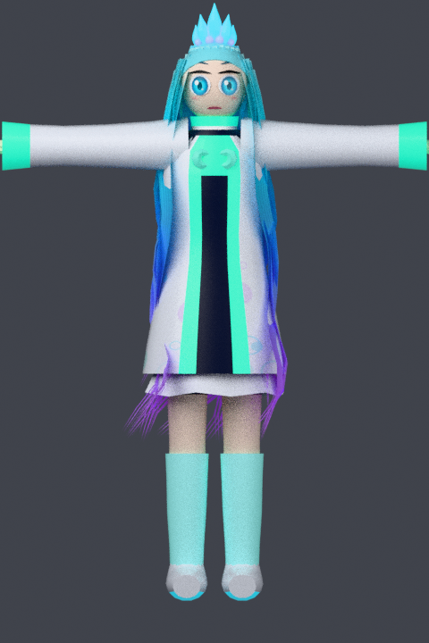
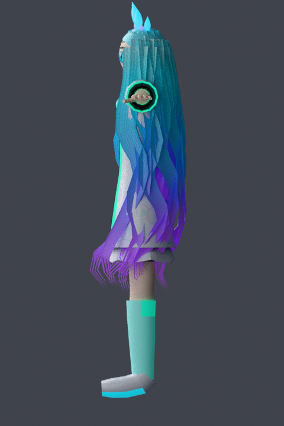
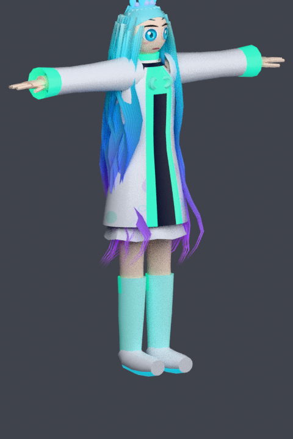
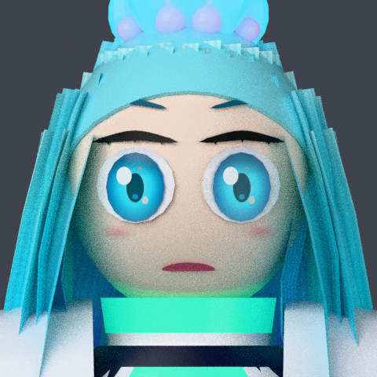
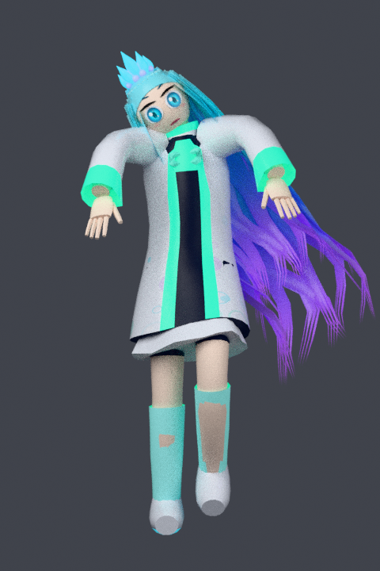
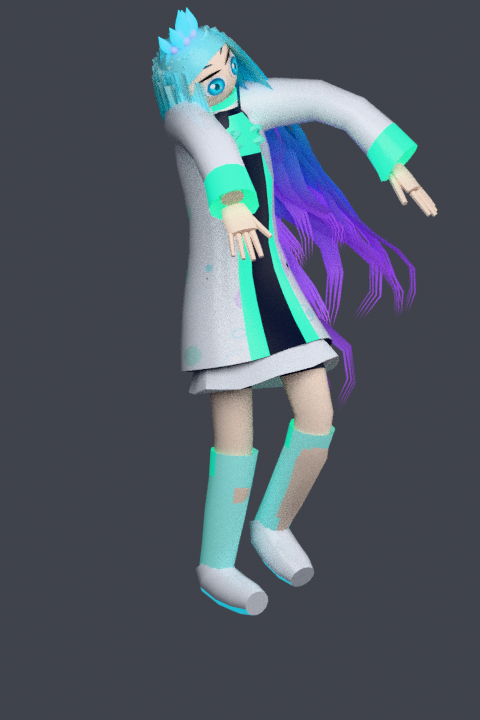
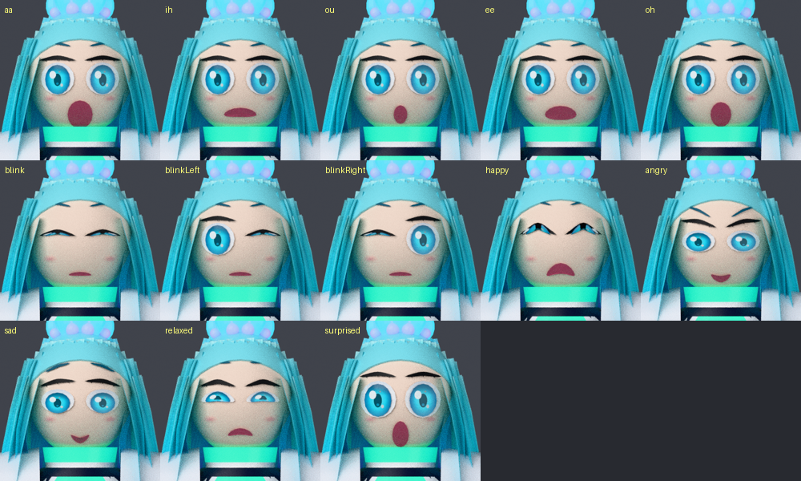

# 手続き生成 VRM アバターパイプライン

Blender (bpy) でキャラクター **スプラーシュ / Supra-shu** をスクリプトから組み立て、
**VRM 1.0** (`VRMC_vrm`) の `.vrm` として書き出す一連のツール。
GUI もモデリング作業も不要で、`build.sh` 一発で完成する。

配色・発光・質感は配色指定書に従っている（`palette.py` にカラーコードを転記）。

出力例: [`assets/avatar.vrm`](../../assets/avatar.vrm)

| 正面 | 側面 | 斜め | 顔 |
|---|---|---|---|
|  |  |  |  |

ポーズを付けた状態（スキニングの確認用。毎回自動で出力される）:

| 正面 | 斜め |
|---|---|
|  |  |



## セットアップ

```bash
pip install bpy          # Blender 本体を Python モジュールとして入れる
```

`bpy` は Python のバージョンに強く依存する（Blender 5.0 系は Python 3.11）。
うまく入らない場合は通常の Blender を入れて `BLENDER` を指定すればよい。

```bash
BLENDER=/path/to/blender tools/vrm/build.sh
```

## 使い方

```bash
tools/vrm/build.sh                 # build/avatar.vrm を生成して検証まで行う
tools/vrm/build.sh --preview       # 確認用レンダリングも出力する

AVATAR_NAME="My Avatar" AVATAR_AUTHOR="you" tools/vrm/build.sh
OUT_DIR=dist tools/vrm/build.sh
```

個別に動かす場合:

```bash
python3 tools/vrm/build_avatar.py --out build/avatar.glb
python3 tools/vrm/glb_to_vrm.py build/avatar.glb -o build/avatar.vrm \
    --name "My Avatar" --author "you" --thumbnail build/thumbnail.png
python3 tools/vrm/validate_vrm.py build/avatar.vrm
python3 tools/vrm/preview.py --out build/preview
```

## ファイル構成

| ファイル | 役割 | bpy 依存 |
|---|---|---|
| `vrm_spec.py` | VRM 1.0 のボーン名・表情名の定義 | なし |
| `rig.py` | 骨格の寸法（ジョイント座標） | なし |
| `geom.py` | ロフト・チューブ・楕円体・面パッチ等のジオメトリ生成 | なし |
| `palette.py` | 配色指定書のカラーコードと質感・発光の定義 | なし |
| `textures.py` | 髪のグラデーションテクスチャ生成 | なし (Pillow) |
| `face.py` | 顔パーツの形状と表情差分の定義 | なし |
| `hair.py` | 髪の房・前髪・頭上パーツの造形 | なし |
| `outfit.py` | コート・インナー・ソックス・スニーカーの造形 | なし |
| `build_avatar.py` | メッシュ／アーマチュア／スキニング／シェイプキー → GLB | あり |
| `preview.py` | Cycles で確認用レンダリング（ポーズ確認込み） | あり |
| `glb_to_vrm.py` | GLB に VRM 拡張を注入して `.vrm` 化 | なし |
| `validate_vrm.py` | 生成物の検証 | なし |
| `compat_test.mjs` | three-vrm + WebGL で実際に読めるか確認する | なし (Node) |

VRM 化と検証は素の Python だけで動くので、Blender 無しの CI でも回せる。

## 生成されるアバターの仕様

- **全高 1.615 m**（頭上パーツ込みで 1.72 m）、素立ちは VRM 必須の **T ポーズ**
- **頂点 5,905 / 面 5,064**（VR でも十分軽い）
- 髪は**ヘアカード**（アルファ抜き板ポリ）。毛先はテクスチャでスパイク状に抜ける
- 顔は**テクスチャ主体**。瞳のグラデーション・二段ハイライト・睫毛・眉・頬の
  赤みを Pillow で手続き描画して貼っている
- **springBone 5 チェーン**（後ろ髪 3 + サイド 2）。頭と胸に球コライダ
- **マテリアル 18 種**。指定書の 7 色を sRGB→リニア変換して使用
- 髪は根元シアン → 毛先グローパープルのグラデーション（生成テクスチャ）
- 発光は指定書の GLOW PLACEMENT MAP に対応
  （頭上パーツ = シアン強 / 胸元・袖口 = エメラルド中〜強 / 毛先・バブル = パープル / インナー = 弱）
- **ボーン 54 本** — VRM 必須ボーン全部 + 首・胸・目・つま先 + 両手の指 30 本
- **表情 14 種**
  - 母音 `aa` `ih` `ou` `ee` `oh`（リップシンク用）
  - まばたき `blink` `blinkLeft` `blinkRight`
  - 感情 `happy` `angry` `sad` `relaxed` `surprised`
  - `neutral`
- **視線** — `lookAt.type = "bone"`。虹彩だけを目ボーンに追従させている
- **一人称** — `firstPerson.meshAnnotations` は `auto`（実行環境が頭無しメッシュを自動生成）
- 全マテリアルに `VRMC_materials_mtoon` を付与（トゥーンシェーディング + 輪郭線）
- サムネイル (512×512 PNG) を埋め込み済み

### 座標系について

Blender では「+X = キャラの左 / −Y = キャラの正面 / +Z = 上」で組み立てている。
glTF 書き出し時に `(x, y, z) → (x, z, −y)` へ変換されるため、
VRM 1.0 が要求する「Y-up で **+Z を向く**」状態になる。
`validate_vrm.py` がこの向きを毎回確認する。

## カスタマイズ

体型・服・顔はすべてパラメータ化してあるので、次の場所を触れば見た目が変わる。

| 変えたいもの | 触る場所 |
|---|---|
| 身長・手足の長さ・関節位置 | `rig.py` の `JOINTS` / `ARM` / `LEG` / `HEAD_*` |
| 体の太さ・シルエット | `build_avatar.py` の `TORSO_PROFILE` と各 `build_*` の `radii` |
| 髪型 | `hair.py`（`build_bangs` / `build_side_locks` / `build_back_hair` の配置と長さ） |
| 髪のグラデーション | `palette.py` の `HAIR_BASE_STOPS` / `HAIR_GLOW_STOPS` |
| 頭上パーツ | `hair.py` の `build_headpiece()` |
| 全体の配色・発光・質感 | `palette.py` の `MATERIALS` |
| 衣装のシルエット | `outfit.py` の `COAT_PROFILE` と各 `build_*` |
| 服の切り替え位置 | `outfit.py` の高さ定数と `build_avatar.py` の `material_for()` |
| 目・眉・口の形 | `face.py` の `BASE` |
| 表情の付き方 | `face.py` の `EXPRESSIONS` |
| 輪郭線の太さ | `glb_to_vrm.py --outline-width`（`0` で無効） |

`rig.py` を変えたら `build_avatar.py` のメッシュ側も追従させる必要がある
（メッシュとボーンは別々に座標を持っているため）。

## ライセンス情報の設定

VRM のメタ情報は `glb_to_vrm.py` の引数で指定する。既定値は最も保守的な設定
（作者のみ利用可・非営利・クレジット必須・改変禁止）になっている。

```bash
python3 tools/vrm/glb_to_vrm.py build/avatar.glb -o build/avatar.vrm \
  --name "My Avatar" --author "you" --contact "https://example.com" \
  --avatar-permission everyone \
  --commercial-usage personalProfit \
  --credit-notation unnecessary \
  --modification allowModificationRedistribution \
  --allow-redistribution
```

## 検証

```bash
python3 tools/vrm/validate_vrm.py build/avatar.vrm
```

必須ボーン、表情のモーフ参照、ノードの重複、向き・全高、
スキンウェイトの正規化、素の状態でモーフが効いていないか等を確認する。

実装リファレンスでの読み込み確認（要 Node.js）:

```bash
npm install
npm run test:vrm          # = node tools/vrm/compat_test.mjs assets/avatar.vrm
```

Chromium を立ち上げ、three-vrm で実際に読み込んで 1 フレーム描画する。
メタ情報・ヒューマノイド・表情・lookAt・MToon・テクスチャ・サムネイルを確認し、
**MToon シェーダが実際にコンパイルできるところまで**検証する。

Node 単体では `GLTFLoader` の画像デコードが DOM を要求するため、
テクスチャ付きモデルは読めない。それがブラウザを使っている理由。

## 既知の制限

- springBone は髪 5 チェーンのみ。コートやリボンは揺れない
- コートの前開きはジオメトリではなくマテリアル分けの簡易表現
- 手はモデル上は単純な形だが、指ボーンは 30 本入っているのでハンドトラッキングには使える
- 素体としての品質であって、作り込んだキャラクターモデルではない。
  作り込みたい場合は生成した `.vrm` を Blender や UniVRM に読み込んで手で編集するとよい

## トラブルシューティング

- `Couldn't open libEGL.so.1` — `preview.py` は GPU 不要の Cycles(CPU) を使うので
  この警告が出ても描画される。Workbench に切り替えると EGL が必要になる
- `pip install bpy` が失敗する — Python のバージョンを確認する。合わない場合は
  通常の Blender を入れて `BLENDER=... tools/vrm/build.sh` を使う
